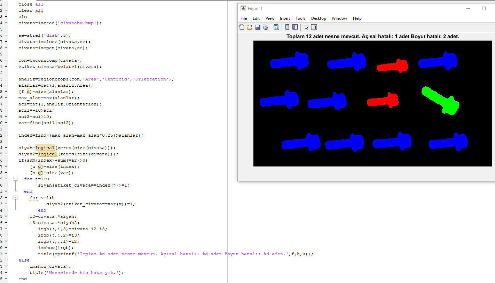

# CIVATALARIN BOYUT VE AÇILARININ KONTROLÜ

## İSTENİLEN

**Maksimum cıvata boyutundan %25'ten daha küçük olanlar => *Kırmızı***
**Duruş açısı -10 ile +10 aralığında olmayanlar => *YEŞİL***
**İki durumu da içerenler *KIRMIZI* ve *YEŞİL* karışımı gösterilecektir**
**Toplam nesne sayısı, boyutu, açısı hatalı nesne sayılarıda çıktı olarak verilecektir.**

## GERÇEKLEME ÖRNEĞİ

