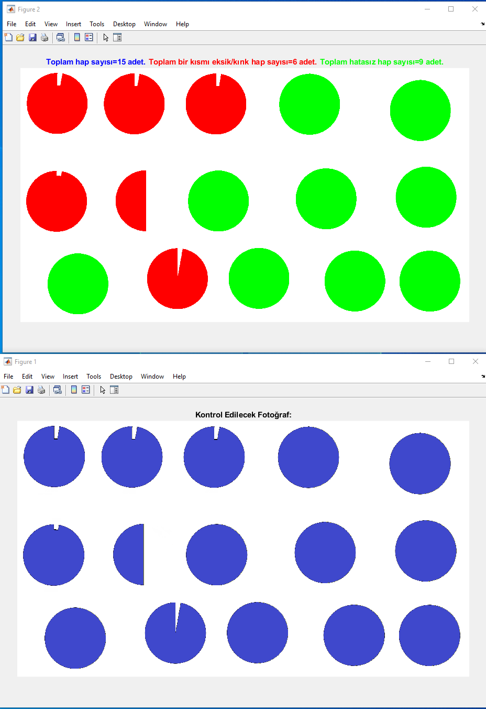
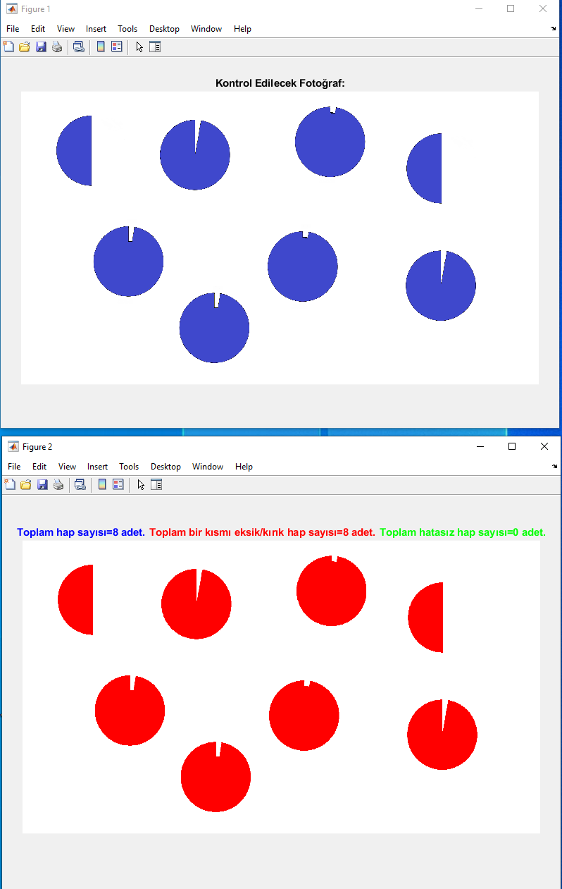
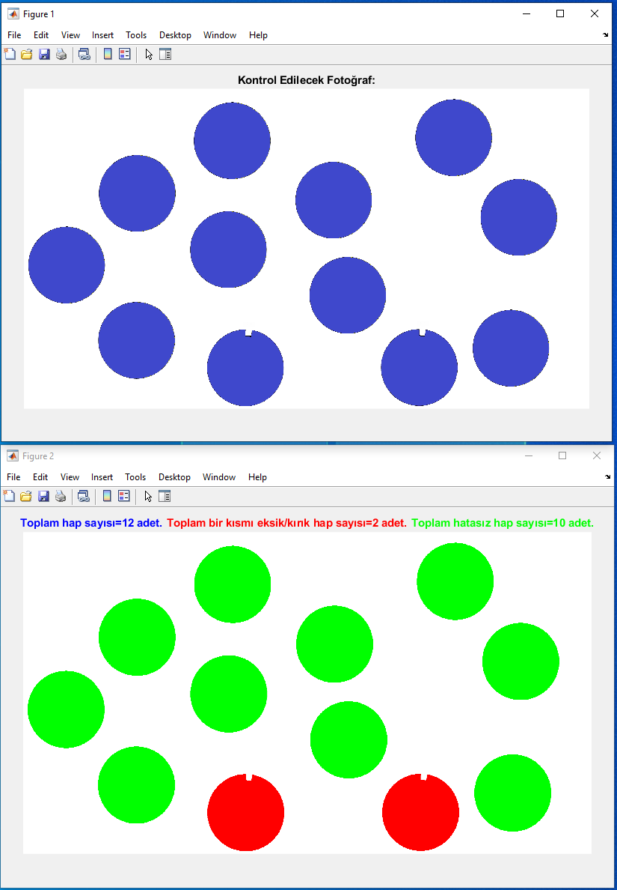
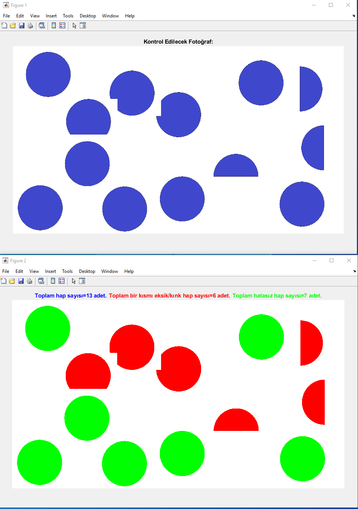

# KIRIK HAP TESPİTİ

## İSTENİLEN

**Verilen görüntüdeki Eksik/Kırık hapların tespiti yapılıp verilerin çıktı olarak verilmesi.**

## GERÇEKLEME ÖRNEĞİ

### ÖRNEK 1

### ÖRNEK 2

### ÖRNEK 3

### ÖRNEK 4

