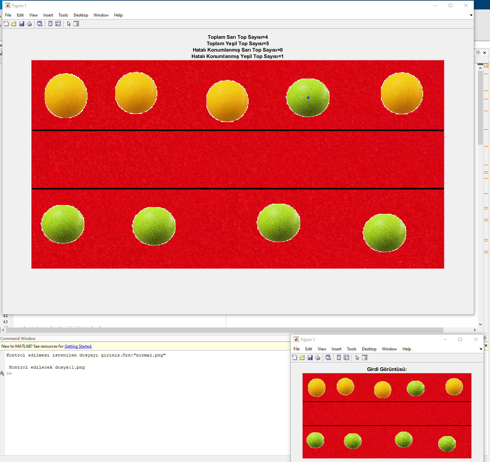
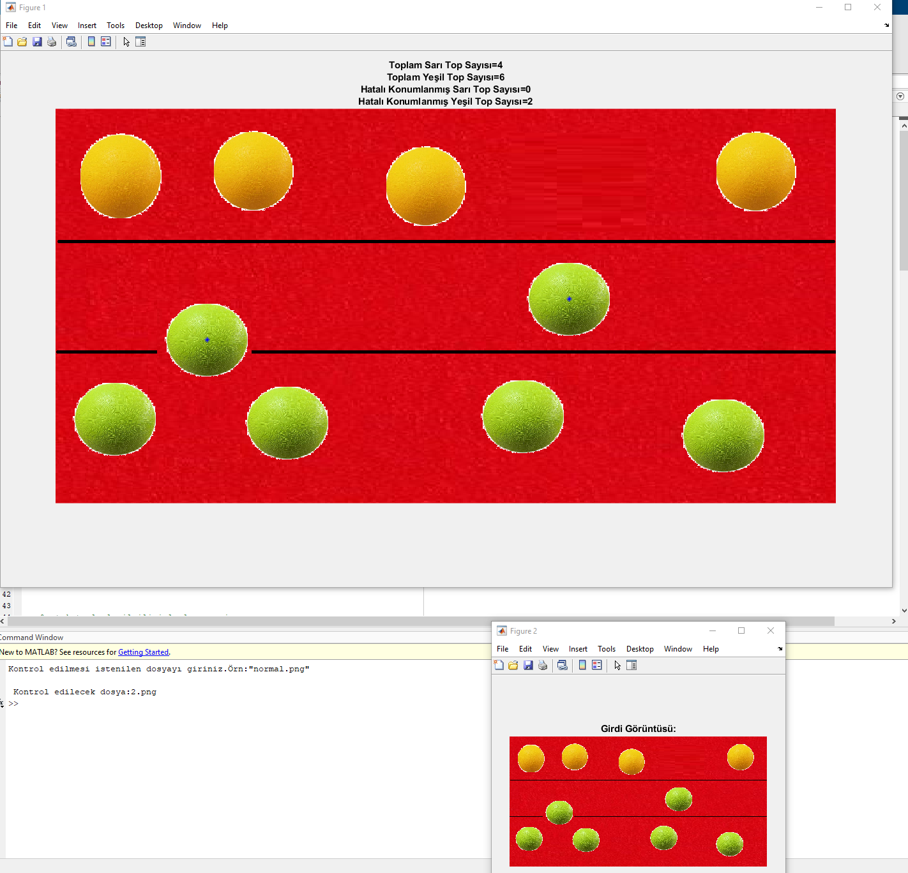
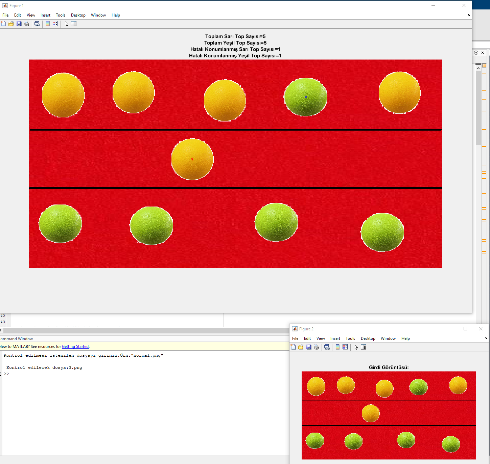
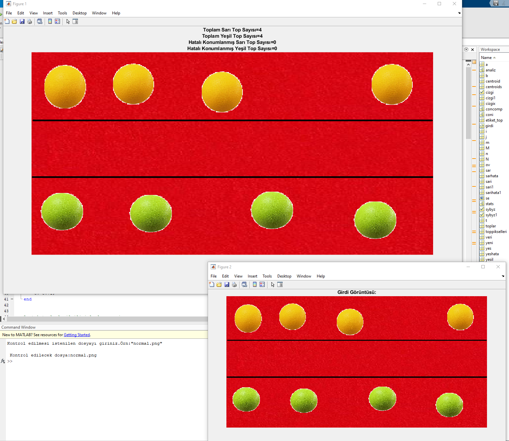

# RENKLİ TOPLARDA KONUM KONTROLÜ

## İSTENİLEN

***SARI* ve *YEŞİL* toplar içeren bant verilmiştir.**
***SARI* toplar üst sınır bölgesini *YEŞİL* toplar alt sınır bölgesini geçtiğinde işaretlenmelidir.**
**Hatalı ve hatasız konumlanmış topların renklerine göre toplam sayıları çıktı olarak verilmelidir.**

## GERÇEKLEME ÖRNEĞİ

### ÖRNEK 1

### ÖRNEK 2

### ÖRNEK 3

### ÖRNEK 4

